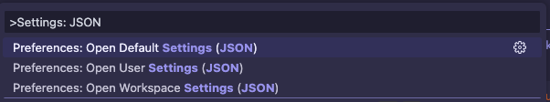

# IDE Configuration for developing UDS Packages

This document will explain how to configure specific IDEs for an improved development experience when working on developing UDS package, such as schema validation for zarf packages, uds bundles and maru tasks. 

## VSCode

To configure your VSCode for schema validation, you must install a yaml language support [extension](https://marketplace.visualstudio.com/items?itemName=redhat.vscode-yaml). From there you have three options. You can configure VSCode globally to provide validations, on a per repo basis or per file basis. 

### Global config

For global or workspace config you can open the command pallette and select the specific level of settings you want to modify. For example select default from the  provided. In the file that opens, add your yaml language server specific settings (and any other spetting you may want globally) in line with the example . Then save the settings.

### Per Repo Config

Either manually or via the Command Palette, you can create a `.vscode/settings.json` at the repo level you are working on. In that settings.json, you can add the appropriate `yaml.schemas` settings, similar to what is found in the  in this repo. Note that the references to the schema version is tagged in the example, depending on your goals it may be appropriate to do this to validate the schema is correct for the version of the tools you expect to be using in the repo. Otherwise, to check if the schema is up to date with the latest, you cna have the links to the schema jsons pointed at `main`.

### Per File Config

If you want to set this up per file you can add a comment at the top of each file pointing to the specific json schema you want validation against. Here is an example of what that would look like for a `zarf.yaml`

```yaml
# yaml-language-server: $schema=https://raw.githubusercontent.com/defenseunicorns/zarf/main/zarf.schema.json
kind: ZarfPackageConfig
metadata:
  name: example
...
```