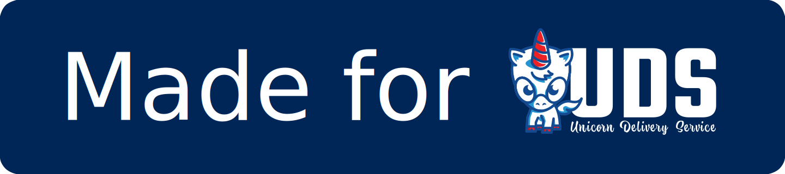

# UDS Package Practices

This document describes the practices that a UDS package **must**, **should** and **may** follow to be considered officially supported as a UDS package and to be able to display the "Made for UDS" badge on its GitHub repository README.md file :

[](https://github.com/defenseunicorns/uds-core)

> [!NOTE]
> This badge should link to the `uds-core` repo and should match the height of any other badges (i.e. `20px`).

> [!TIP]
> This document follows [RFC-2119](https://datatracker.ietf.org/doc/html/rfc2119) for definitions of requirement levels (e.g. **must**, **should** and **may**)

## Integrations

Below are the minimal services that a UDS package **must** integrate with, using the [UDS `Package` custom resource](https://github.com/defenseunicorns/uds-core/blob/main/src/pepr/operator/README.md#example-uds-package-cr).  These integrations **must** be declarative and automated without requiring click-ops from the person deploying the package.  Packages also **should** consider integrations with any additional UDS services that are relevant to that application.

> [!NOTE]
> Additional services will be added and integration requirements will change as `uds-core` continues to evolve.  UDS Package implementers **should** keep up with `uds-core` releases and changes to this document.  The "Made for UDS" badge **may** be requested to be removed if a package is not updated in a timely fashion.

### Istio

- **Must** define any external interfaces under the `expose` key.
- **Must** deploy and operate successfully with Istio injection enabled in the namespace.
- **Should** avoid workarounds such as disabling strict mTLS peer authentication.

### Network Policies

- **Must** define network policies under the `allow` key as required.
- **Should** minimize network policies to specific selectors needed for Ingress/Egress traffic.
- **May** template network policy keys to provide flexibility for delivery customers to configure.

### Keycloak

- **Must** use and create a Keycloak client through the `sso` key if the application provides an end-user login.
- **Should** consider security options during implementation to provide the most secure default possible (i.e. SAML w/SCIM vs OIDC).
- **Should** name the client `<App> Login` (i.e. `Mattermost Login`) to provide login UX consistency.
- **Should** clearly mark the client id with the group and app name `uds-<group>-<application>` (i.e. `uds-swf-mattermost`) to provide consistency in the Keycloak UI.
- **May** end any generated secrets with `-sso` to easily locate them when querying the cluster.
- **May** template Keycloak fields to provide flexibility for delivery customers to configure.

### Prometheus

- **Must** implement monitors for each application metrics endpoint using it's built-in chart monitors, the `Package` CR `monitor` key, or manual monitors in the config chart.

## Exemptions

UDS Packages **may** make use of the [UDS `Exemption` custom resource](https://github.com/defenseunicorns/uds-core/blob/main/src/pepr/operator/README.md#example-uds-exemption-cr) for exempting any Pepr policies, but in doing so they:

- **Must** minimize the scope and number of the exemptions to only what is absolutely required by the application
- **Must** have documented rationale for any exemptions present

## Structure

Packages also follow structural guidelines to ensure consistency and flexibility for configuration, they:

- **Should** expose all configuration (`uds.dev` CRs, additional `Secrets`/`ConfigMaps`, etc) through a Helm chart (ideally in a `chart` or `charts` directory).
  > This allows UDS bundles to override configuration with Helm overrides and enables downstream teams to fully control their bundle configurations.

- **Should** limit the use of Zarf variable templates and prioritize configuring packages via Helm value overrides
  > This ensures that the package is configured the same way that the bundle would be and avoids any side effect issues of Zarf's `###` templating

- **Should** implement or allow for multiple flavors (ideally with common definitions in a `common` directory)
  > This allows for different images or configurations to be delivered consistently to customers.

## Testing

A UDS Package will also have testing and quality checks to ensure that updates / changes to them result in minimal churn.  Packages:

- **Must** implement Journey Testing to cover the basic user flows and features of the application, especially where an application interacts with an external service / interface.
  > This can by something like Playwright / [Cypress](https://github.com/defenseunicorns/uds-identity-config/tree/main/src/test/cypress) tests for services with a Web UI or something like [Jest](https://github.com/defenseunicorns/uds-package-gitlab-runner/tree/main/test) tests for headless services.

- **Must** implement Upgrade Testing to ensure that the current development package works when deployed over the previously released one.

- **Should** lint their configurations with appropriate tooling such as [`yamllint`](https://github.com/adrienverge/yamllint) and [`zarf dev lint`](https://docs.zarf.dev/commands/zarf_dev_lint/).


## Maintenance

To help maintain a UDS Package, it:

- **Must** have a dependency management bot (such as renovate) configured to open PRs to update core package and support dependencies.

- **Must** release its package to the `ghcr.io/defenseunicorns/packages/<group>` namespace as the application's name (i.e. `ghcr.io/defenseunicorns/packages/uds/mattermost`)

## Versioning

- **Must** be versioned as follows:
```
<upstream-app-version>-uds.<uds-sub-version>
```

Where,

- `upstream-app-version`: is the version of the main application in the package (i.e. `17.2.1` for GitLab)
- `uds-sub-version`: is the number of releases since the last main application version bump (starting at `0`)

In practice, this results in the following for the second release of a package for version `17.2.1` of GitLab:

```
17.2.1-uds.1
```

## General

And in addition to the above, packages generally:

- **Must** be capable of operating within an internet-disconnected (air-gapped) environment

- **Must** be maintained by a resourced team that is explicitly defined as maintaining the project (i.e. in `CODEOWNERS`)
