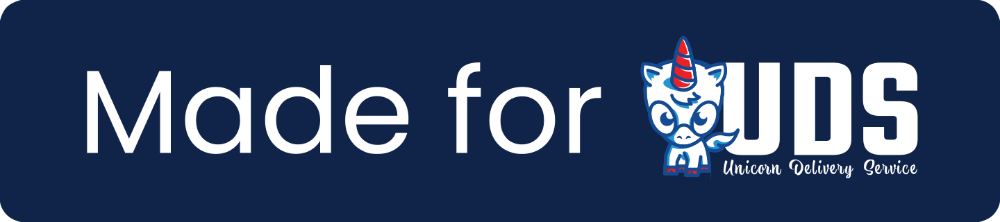

# UDS Package Practices

This document describes the practices that a UDS package **must**, **should**, and **may** follow to be considered officially supported as a UDS package and to be able to display the "Made for UDS" badge on its GitHub repository README.md file:

> [!NOTE]
> This badge should link to the `uds-core` repo and should match the height of any other badges (i.e. `20px`).

## Integrations

Below are the minimal services that a UDS package **must** integrate with:

### Istio

- **Must** define external interfaces under the `expose` key **_(if applicable - i.e. has a web interface)_**.
- **Must** deploy and operate successfully with Istio injection enabled in the namespace.
- **Should** avoid workarounds such as disabling strict mTLS peer authentication.

### Network Policies

- **Must** define network policies under the `allow` key as required.
- **Should** minimize network policies to specific selectors needed for Ingress/Egress traffic.
- **May** template network policy keys to provide flexibility for delivery customers to configure.

### Keycloak

- **Must** create a client through the `sso` key and use that client for user login **_(if applicable - i.e. allows user login)_**.
- **Should** consider security options during implementation to provide the most secure default possible.
- **Should** name the client `<App> Login` (i.e. `Mattermost Login`) to provide UX consistency.
- **May** template Keycloak fields to provide flexibility for delivery customers to configure.

## Structure

Packages also follow structural guidelines to ensure consistency and flexibility for configuration, they:

- **Should** expose configuration through a chart (ideally in a `chart` or `charts` directory).
  > This allows UDS bundles to override configuration with Helm overrides.

- **Should** implement or allow for multiple flavors (ideally with common definitions in a `common` directory)
  > This allows for different images or configurations to be delivered consistently to customers.

## Testing

A UDS Package will also have testing and quality checks to ensure that updates / changes to them will flow smoothly over time.  Packages:

- **Must** implement Journey Testing to cover the basic user flows and features of the application, especially where an application interacts with an external service / interface.

- **Must** implement Upgrade Testing to ensure that the current development package works when deployed over the previously released one.

- **Should** lint their configurations with appropriate tooling such as `yamllint` and `zarf dev lint`.

## Maintenance

To help maintain a UDS Package, it:

- **Must** have a dependency management bot (such as renovate) configured to open PRs to update core package and support dependencies.

- **Must** release its package to the `ghcr.io/defenseunicorns/packages/<group>` namespace as the application's name (i.e. `ghcr.io/defenseunicorns/packages/uds/mattermost`)
