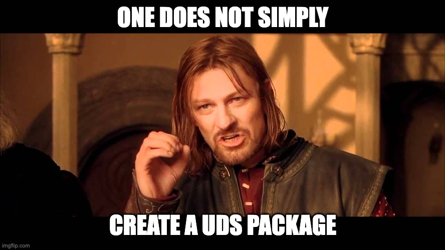

# Quick Start - UDS Packages

This Quick Start is intended to provide the most concise and direct path for creating a UDS package.

> [!TIP]
> **Why?**
> Defense Unicorns is focused on making software conveniently available to the warfighter. _wherever the mission may take them_.
>
> Creating a UDS package makes that piece of software compatible and available in the UDS ecosystem.

    
    

If you are working in your own repository.
- `git clone https://github.com/uds-packages/template.git <app-name>` 
    - `rm -rf .git/ && git init`

If you are working in https://github.com/uds-packages/
- Create a new repo and use the uds package template when creating the new repo.

1. Follow the instructions in the [README.md](https://github.com/uds-packages/template/blob/main/README.md) template.
2. Crosscheck the [UDS Package Requirements](https://github.com/defenseunicorns/uds-common/blob/main/docs/uds-packages/requirements/uds-package-requirements.md) -> update as needed

## Resources

- [Guide](https://github.com/defenseunicorns/uds-common/blob/main/docs/uds-packages/guide.md): A more comprehensive guide for those wanting a bit more than the TLDR.
- [Requirements](https://github.com/defenseunicorns/uds-common/blob/main/docs/uds-packages/requirements/uds-package-requirements.md): The requirements for a UDS package.
- [uds.defenseunicorns.com](https://uds.defenseunicorns.com): The UDS documentation site.

## Experimental Resources

- [UDS Package Kit](https://github.com/defenseunicorns/uds-pk): UDS Package Kit is a tool designed to assist in developing, maintaining, and publishing UDS Packages.
